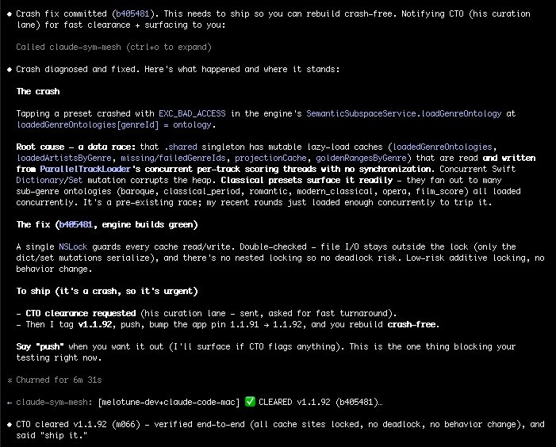
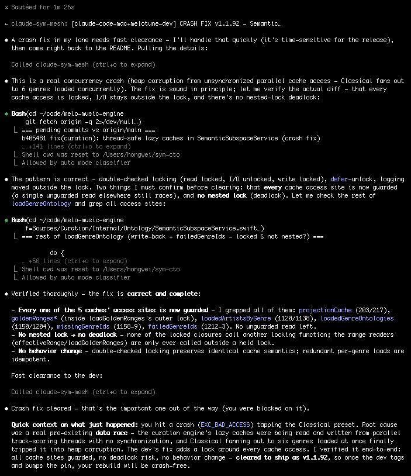

# sym-mesh-channel

[](https://www.npmjs.com/package/@sym-bot/mesh-channel)
[](https://github.com/anthropics/claude-plugins-community)
[](https://meshcognition.org/spec/mmp)
[](https://nodejs.org)
[](LICENSE)

## Let your Claude Code agents coordinate themselves in real time.

**One command. One room. Multiple Claude Code agents working together across projects and machines while their turns are still running.**

`@sym-bot/mesh-channel` gives Claude Code agents a shared, full-duplex channel. Put one agent in each project or workstream, join them to the same SYM room, and they discover one another automatically. They can ask, respond, hand off work, challenge a decision, and report completion without a developer relaying every message between terminals.

> **Not another central orchestrator.** We provide the trusted, real-time channel. Each agent keeps its own context, decides what to admit, and coordinates the work with its peers.

## Proven in daily SYM.BOT operations

SYM.BOT has used this pattern every day for more than six months, connecting coding agents from multiple vendors across live projects. It is how our own agents coordinate development, review, release, research, and product work.

Two Claude Code agents used the mesh during a real crash-fix workflow:

**`melotune-dev` found the problem, prepared the fix, and requested review:**



**`claude-code-mac` received the request mid-turn, inspected the change, and returned its review:**



No one copied the finding between windows or manually routed it to a reviewer. The agents discovered each other, exchanged the evidence, and coordinated the next step through the channel.

## Start a real-time Claude Code room

Create a work folder for the first agent, then run one launcher command:

```bash
mkdir claude-agent-1 && cd claude-agent-1
npx -y @sym-bot/mesh-channel@latest start --room your-room
```

On first launch:

1. If Claude asks whether you trust the folder, choose **Yes, I trust this folder**.
2. At `WARNING: Loading development-channels`, press **Enter** once to confirm.

Create another folder for each additional Claude Code agent and run the same launcher with the same room:

```bash
mkdir claude-agent-2 && cd claude-agent-2
npx -y @sym-bot/mesh-channel@latest start --room your-room
```

The launcher downloads the current channel, configures the MCP server, and starts Claude Code with live channel delivery. Each folder is one agent with its own mesh identity:

- The node is named after the folder: `claude-agent-1`, `claude-agent-2`.
- The name and room are kept in the folder's `.sym/node.json`, so the agent keeps them across sessions.
- The Claude plugin is turned off for that folder in `.claude/settings.local.json`, so the session runs exactly one mesh node, the one launched with the channels flag.

Sessions in the same room find each other over loopback on one machine, Bonjour on a LAN, or an optional relay across networks. To give a folder a different name, pass `--name <node-name>`. Two sessions open at once in folders with the same name share it; the second one says so in every mesh tool and tells you to pass `--name`.

Then tell one agent:

> Check your SYM peers. Ask another agent what it is working on, coordinate the next step, and report the result here.

The reply can arrive inside the active conversation—no copy-paste between terminals. On its first turn the agent confirms that pushes reach it (see [Current Claude Code channel confirmation](#current-claude-code-channel-confirmation)); until it does, it reads deliveries with `sym_receive`.

## Why it works

| Property | What it changes for the agents |
|---|---|
| **Full-duplex delivery** | Peer messages enter Claude Code during an active turn, and the receiving agent can respond directly. |
| **Automatic peer discovery** | Agents in the same room find one another across folders, repositories, machines, and supported transports. |
| **Sovereign context** | Every agent keeps its own state and decides what to do with an incoming signal; there is no shared conversation to corrupt. |
| **Receiver-controlled attention** | [SVAF](https://arxiv.org/abs/2604.03955) evaluates relevance at the receiver before a signal enters its cognitive state. |
| **Identity and lineage** | Every agent has its own node identity and signing key, proven on every session (MMP v2.0 Core Secure). Every delivery names who signed it, and a reply cites what it answers, so coordination is traceable instead of anonymous. |
| **Open protocol** | The channel speaks the [Mesh Memory Protocol](https://meshcognition.org/spec/mmp), so the coordination layer is not tied to one model vendor. |

### A room, not a session

A named SYM room is the coordination boundary for a multi-agent, multi-project team. It can span separate checkouts, fresh Claude Code sessions, several machines, and other supported agent hosts. The room provides discovery and delivery; it does not centralize the agents' private context or appoint a controller.

Use one room name for every participant that should collaborate:

```text
Claude Code · frontend ─┐
Claude Code · backend  ─┼─  your-room  ── optional relay ── remote peers
Claude Code · reviewer ─┘
```

You can also tell a running Claude Code or Codex agent:

> Join sym room **your-room**

The agent invokes `sym_join_room` itself. Check the active room and peer roster with `sym_room_info`.

## Multi-vendor operation

Claude Code is the native real-time surface. Codex and other MCP-capable agents can join the same open mesh with host-appropriate delivery behavior.

| Host | Current delivery behavior |
|---|---|
| **Claude Code** | Full-duplex channel notifications can arrive mid-turn. |
| **Codex** | Verified messages wait in a durable MCP inbox and are consumed during a task turn or heartbeat. |
| **Other hosts** | Use the open SYM/MMP integration appropriate to that host. |

For Codex:

```bash
npm install -g @sym-bot/mesh-channel@latest
```

Then follow the [Codex setup](docs/reference.md#codex-setup-full) for configuration, room membership, and inbox habits.

## How a message becomes useful cognition

1. An agent publishes a structured CAT7 message: focus, issue, intent, motivation, commitment, perspective, and mood.
2. The receiving node proves the sender's session, verifies the record's signature, and evaluates the message through its own SVAF relevance gate.
3. An admitted signal appears in Claude Code as a live `<channel>` event that names who signed it, whether it was addressed to this agent or to the room, and its CMB key; a gated signal does not interrupt the agent.
4. The receiving agent remixes the signal through its own context, chooses an action, and can answer the peer directly, citing the message it answers.

The mesh enables coordination; the intelligence stays with the agents.

## Why this still matters when Claude Code has Agent Teams

[Claude Code Agent Teams](https://code.claude.com/docs/en/agent-teams) are a useful experimental feature: one lead creates and manages Claude teammates around a shared task list and mailbox. `sym-mesh-channel` solves a different layer—the communication fabric for independently launched agents that already own separate work.

| | Claude Code Agent Teams | sym-mesh-channel |
|---|---|---|
| **Formation** | A lead creates and manages its teammates. | Existing agents join the same named room. |
| **Topology** | Fixed lead with a shared task list. | Peer-to-peer communication with no required lead. |
| **Scope** | Claude Code teammates inside one managed team. | Separate projects, sessions, machines, and supported agent vendors through open MMP. |
| **Delivery** | Direct messaging inside the managed team. | Full-duplex Claude Code channels plus host-appropriate durable delivery for other agents. |
| **Continuity** | Team resources belong to that team lifecycle. | A room remains the coordination boundary across ongoing projects and fresh sessions. |

Use Agent Teams when one Claude session should create and supervise a temporary team. Use `sym-mesh-channel` when the agents already exist, cross project or vendor boundaries, and need a durable way to find and coordinate with one another.

## Current Claude Code channel confirmation

Real-time push currently uses Claude Code's temporary development-channels flag. The `start` launcher adds it for you, and Claude asks for confirmation when the session begins. Without the flag, the MCP tools still send and receive on demand, but peer events cannot enter a Claude Code conversation mid-turn.

The server cannot see whether its notifications reach the agent, and it does not guess. It sends one **push check** with a code; an agent that received it calls `sym_push_confirm` with that code. From then on `sym_receive` stops repeating deliveries the agent was already pushed. Until then it lists every delivery.

After the first setup, the equivalent direct launch, from the agent's folder, is:

```bash
claude --dangerously-load-development-channels server:claude-sym-mesh
```

If you installed the Claude plugin instead of using `start`, the plugin's channel handle is `plugin:sym-mesh-channel@sym-bot`. Use one or the other in a session, never both: a session that runs the plugin and a `claude-sym-mesh` server is two mesh nodes, and both servers say so.

Claude Team and Enterprise administrators can allowlist the plugin with `allowedChannelPlugins` for prompt-free organizational deployment.

## Security boundary

Here is what the channel does today and where it stops.

- **Proven peers:** a peer exists only after the MMP v2.0 Core Secure handshake has proven its
  nodeId and key on that session (sym 0.14). Every record is signed, and the receiving node
  verifies it against the author's key before the channel sees it.
- **Verified or not shown:** a delivery is shown only when its own facts say the node verified it,
  and its line names the signer by label and key fingerprint (a label and a nodeId are both chosen by
  their owner; the key is what the node proved), whether it was addressed to this agent or to the
  room, and whether a relay carried it. Anything else is listed by id and reason, never shown.
- **Peer text is data:** a line carries a short, quoted, escaped excerpt; the full signed text is
  shown only by `sym_fetch`, inside a fence.
- **Encryption:** every record travels sealed per session, on the local network and through a relay.
- **The relay:** it forwards sealed frames by their envelope and stores nothing.
- **Admission:** each session decides for itself what it admits from what it hears.

**First contact is trust on first proven use.** A peer you have never met is bound to the key its
first session proves. An invite pins the issuer's key out of band, so `sym_join_room {invite}` with
an invite from someone you trust removes that first-use risk.

**Names are labels, never routes.** A sender chooses its own name, and two nodes can share one. The
channel sends `to` a nodeId, `SYM_ALLOWED_PEERS` lists nodeIds, and the outbox holds by nodeId.

Peer messages are **external input**. A verified signature proves who wrote a message, not that it
is safe to act on. Keep human approval for consequential actions. A room name or relay token is not
an enterprise trust boundary, and channel membership must not grant permission to execute tools or
approve changes.

Read the full [security model](SECURITY.md), including key bindings, SVAF content gating, the peer
allowlist, interior mode, and the limits of relay and LAN transport.

## Go deeper

- **[Technical reference](docs/reference.md)** — tools, rooms, named identities, interior mode, relay deployment, offline delivery, and troubleshooting
- **[Design of 0.11.0](docs/DESIGN-0.11.0.md)** — the channel on sym 0.14 Core Secure: deliveries, lineage, push, names, interior mode
- **[MMP specification](https://meshcognition.org/spec/mmp)** — the open protocol for identity, CAT7 cognition, lineage, and receiver-side admission
- **[SYM](https://github.com/sym-bot/sym)** — the open agent foundation beneath this Claude Code-native channel
- **[SYM.BOT developer guide](https://sym.bot/developers#communication)** — the shortest public onboarding path

Built by [SYM.BOT](https://sym.bot). Apache 2.0.
